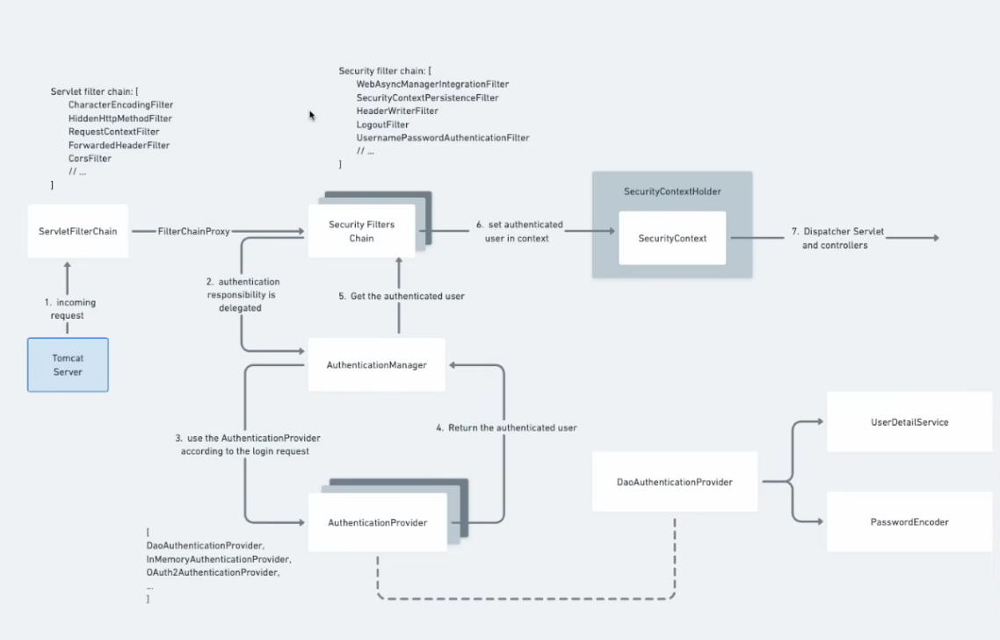

# 🚀 Spring Security Setup Guide

<a href="https://www.codingshuttle.com/spring-boot-handbook/internal-working-of-spring-security-basic/">Document</a>

Add below dependencies to your pom.xml

```xml
<dependency>
			<groupId>org.springframework.boot</groupId>
			<artifactId>spring-boot-starter-security</artifactId>
</dependency>
```

## ⚙️ configure default setup

The Spring secuirty can be configured via various fiter chains

below two properties can be added into application.propteries to change the default password and user

```properties
#Spring security config
spring.security.user.name=user
spring.security.user.password=password
```
To enable the routes access to the differen user or USER roles can be done by the filter chain config

```java
@Bean
public SecurityFilterChain securityFilterChain(HttpSecurityhttpSecurity) throws Exception {
    httpSecurity.authorizeHttpRequests(auth->
                auth.requestMatchers("/public").permitAll()
                        .requestMatchers("/admin/**").hasRol("ADMIN").requestMatchers("/doctors/**")hasAnyRole("DOCTOR","ADMIN")
            ).formLogin(Customizer.withDefaults());
    return httpSecurity.build();
}
```
&rarr; `formLogin` is used to enable/disable and configure the default login page


creating the dummy user for testing purpose

```java
@Bean
public UserDetailsService userDetailsService(){
    UserDetails user1 = User.withUsername("admin").passwor(passwordEncoder.encode("pass")).roles("ADMIN").build();
    UserDetails user2 = User.withUsername("patient").passwor(passwordEncoder.encode("pass")).roles("PATIENT").build();
    return new InMemoryUserDetailsManager(user1,user2);
}
```

Spring security internals




steps to do jwt based login

create the user entiy to store the userdetails.

and extend the user entity with the interface UserDetails class from spring security.

now create your own user detail service class and extend it with interface UserDetailservice
and implement one required method there 

create the authentication controller with login and signup 
route


we will need now authservice and 