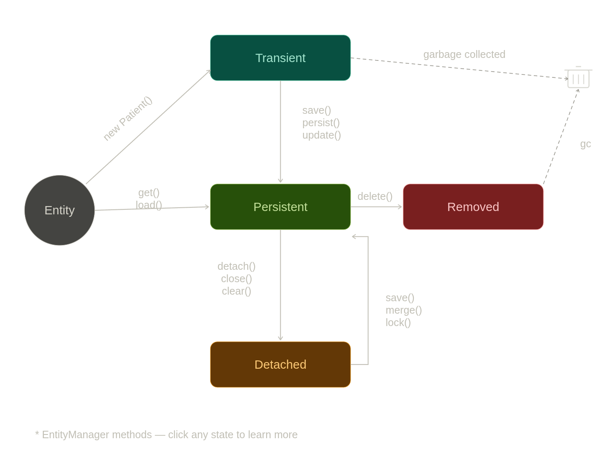
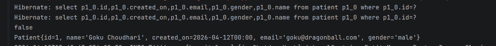
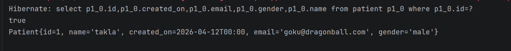

# 🚀 Spring Boot JPA Setup Guide

## ⚙️ 1. Database Configuration

📌 First, configure your database in `application.properties`

```properties
# 🗄️ DB_CONFIG

spring.datasource.url=jdbc:postgresql://localhost:5432/orbit
spring.datasource.username=admin
spring.datasource.password=mypassword

spring.jpa.hibernate.ddl-auto=update
spring.jpa.show-sql=true
spring.jpa.properties.hibernate.format_sql=false
```

---

## 🧩 2. Create Entity Class

📌 Use `@Entity` to map your class to a database table

```java
package com.orbyte.hospitalmvn.entity;

import jakarta.persistence.*;
import org.hibernate.annotations.CreationTimestamp;
import java.time.LocalDateTime;

@Entity
public class Patient {

    @Id
    @GeneratedValue(strategy = GenerationType.IDENTITY)
    private long id;

    private String name;

    @CreationTimestamp
    @Column(columnDefinition = "DATE DEFAULT CURRENT_DATE")
    private LocalDateTime created_on;

    private String email;

    private String gender;

}
```

💡 **What’s happening here?**

* 🆔 `@Id` → Primary key
* 🔄 `@GeneratedValue` → Auto increment
* ⏱️ `@CreationTimestamp` → Auto set creation time

---

## 📦 3. Create JPA Repository

📌 This interface helps you interact with the database easily

```java
package com.orbyte.hospitalmvn.repository;

import com.orbyte.hospitalmvn.entity.Patient;
import org.springframework.data.jpa.repository.JpaRepository;

public interface PatientRespository extends JpaRepository<Patient, Long> {}
```

💡 **Built-in methods like:**

  * `findAll()`
  * `save()`
  * `deleteById()`

---

## 🧪 4. Test the Repository

📌 Now let’s fetch data using a test class

```java
@SpringBootTest
public class PatientRepositoryTest {

    @Autowired
    private PatientRespository patientRespository;

    @Test
    public void testPatientRepository() {

        List<Patient> patientlist = patientRespository.findAll();

        System.out.print(patientlist);

    }

}
```
## 5.Internal JPA Working

* The Jpa repository is implement by the SimpleJpaRepository class
* it uses EntityManager

## Entity Manager Lifecycle



* When the persist call is made data is moved from transient to persistent state  and after successfull completion of txn data is stored in db else it rolled back

Below snipped is very intresting for understanding the `@Transactional` behavior.

## 💱 6. Database Transactions

* **All or Nothing:** A transaction ensures a series of operations either fully succeed together or completely fail, maintaining consistency.
* **Auto Rollback:** If an exception occurs, JPA instantly un-does (rolls back) any changes, leaving the database unaffected.

     See below snippet to understand the difference using @Transactional and not

``` java
    public Patient getPatient(Long id){
        Patient p1 = patientRespository.findById(id).orElseThrow();
        Patient p2  = patientRespository.findById(id).orElseThrow();
        System.out.println(p1==p2);
        return p1;
    }
```

output without Transactional



snippet two with @Transactional

``` java
    @Transactional
    public Patient getPatient(Long id) {
        Patient p1 = patientRespository.findById(id).orElseThrow();
        Patient p2 = patientRespository.findById(id).orElseThrow();
        System.out.println(p1 == p2);
        p1.setName("takla");
        return p1;
    }

```
Output


Now here if you see the only single querry to check the patient is executed and the same object is returned


### 7. More annotations on entity

```java
@Table(
        name="Patient",
        uniqueConstraints = {
                @UniqueConstraint(name="unique_patient_email",columnNames = {"email"}),
                @UniqueConstraint(name="unique_email_and_name",columnNames = {"name","email"})
        },
        indexes={
              @Index(name = "email_idx",columnList = "email")  
        }
)
```

**Explanation:**
* **`name`**: Explictly sets the database table name to "Patient".
* **`uniqueConstraints`**: Prevents duplicate entries for the `email` column alone, and for the combination of `name` + `email`.
* **`indexes`**: Creates a database index on the `email` column to greatly speed up searches and lookups.